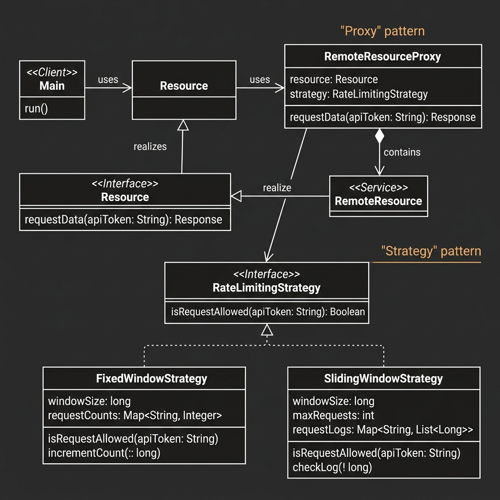

# API Rate Limiter

This project implements a flexible API Rate Limiting system in Java, demonstrating the **Proxy Pattern** and various rate-limiting algorithms.



## Design Overview

The system provides a transparent way to add rate-limiting capabilities to existing resources without modifying their core logic.

### Core Components

1.  **Resource (Interface)**: Defines the common contract for accessing data or services.
2.  **RemoteResource**: The actual implementation of the service that we want to protect from excessive requests.
3.  **RemoteResourceProxy**: Implements the `Resource` interface and wraps a `RemoteResource`. It intercepts calls to check if the request is within the allowed rate limits before delegating the call.
4.  **RateLimitingStrategy (Interface)**: Defines the algorithm for tracking and allowing/rejecting requests.
    - **FixedWindowStrategy**: Tracks request counts within fixed time buckets (e.g., 100 requests per minute).
    - **SlidingWindowStrategy**: Tracks requests using a moving time window for smoother rate limiting.

## Design Patterns

- **Proxy Pattern**: The `RemoteResourceProxy` acts as a surrogate for the `RemoteResource`, adding a rate-limiting pre-process.
- **Strategy Pattern**: Different rate-limiting algorithms can be plugged into the proxy at runtime via the `RateLimitingStrategy` interface.

## Getting Started

### Prerequisites
- JDK 8 or higher.

### Compilation
```bash
javac -d out src/main/java/org/example/**/*.java src/main/java/org/example/*.java
```

### Running the Demo
```bash
java -cp out org.example.Main
```
