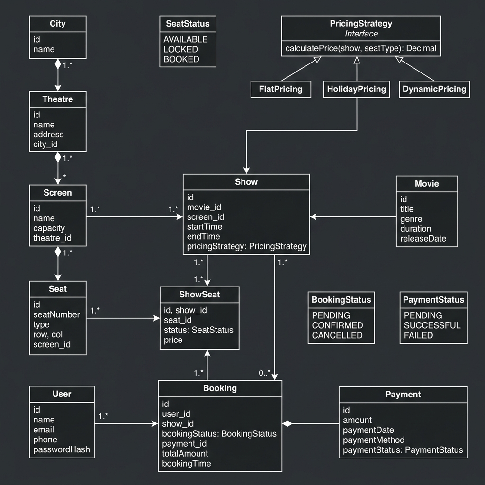

# BookMyShow - Low Level Design

This project implements the core logic for a movie ticket booking platform.



## Design Overview

The system is designed following SOLID principles and utilizes the **Strategy Pattern** for flexible show pricing.

### Core Components

1.  **Theatre & Screen**: A city contains multiple theatres, each having multiple screens.
2.  **Movie & Show**: Movies are played in theatres via Shows. Each show is linked to a specific screen and time.
3.  **Seat & ShowSeat**: `Seat` represents the physical seat in a screen. `ShowSeat` represents the booking status (Available, Locked, Booked) of a seat for a specific show.
4.  **Booking & Payment**: Orchestrates the ticket booking lifecycle, including temporary seat locking and payment processing.

### Design Patterns

- **Strategy Pattern (Pricing)**: The `PricingStrategy` interface allows for different pricing models (Flat, Holiday, Dynamic) without modifying the `Show` or `Booking` logic.
- **Service Layer**: Business logic is encapsulated in services like `BookingService` and `TheatreService` to maintain a clean separation from models.

## Requirements

### Functional Requirements
- View movies and theatres in a city.
- Check show timings and seat availability.
- Temporarily lock seats during booking.
- Confirm booking upon successful payment.
- Handle cancellations and refunds.

### Concurrency Support
- The system ensures that no two users can book the same seat simultaneously using locking mechanisms (Optimistic/Pessimistic).
- Seat locks have a configurable timeout (e.g., 5 minutes).

## Getting Started

### Prerequisites
- JDK 8 or higher.

### Running the Demo
```bash
# Compile
javac -d out src/main/java/org/example/**/*.java src/main/java/org/example/*.java

# Run
java -cp out org.example.Main
```
