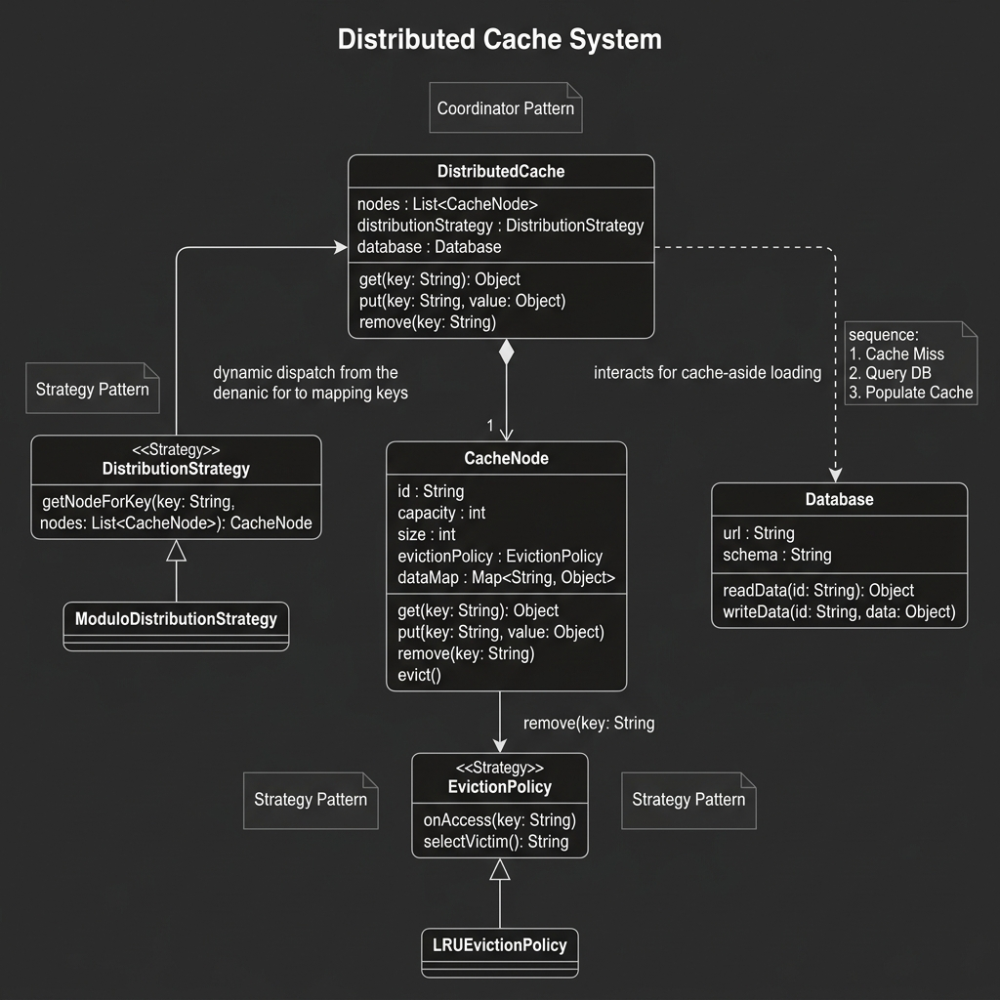

# Distributed Cache System

A flexible and extensible in-memory Distributed Cache implementation in Java. This project demonstrates low-level design (LLD) principles using pluggable strategies for data distribution and cache eviction.



## Design Overview

The system uses a **Coordinator Pattern** where a central component orchestrates data placement and retrieval across multiple nodes.

### Core Components

1.  **DistributedCache**: The orchestrator that handles client requests. It uses a `DistributionStrategy` to decide which node should store or retrieve a specific key.
2.  **DistributionStrategy**: An interface for key-to-node mapping algorithms. 
    - `ModuloDistributionStrategy`: Default implementation using consistent hashing principles (simplified as modulo).
3.  **CacheNode**: Represents an individual storage unit. Each node has its own capacity and an `EvictionPolicy`.
4.  **EvictionPolicy**: Defines how records are removed when a node reaches capacity.
    - `LRUEvictionPolicy`: Implements Least Recently Used logic.
5.  **Database**: A mock persistent store that the system interacts with during cache misses (Cache-Aside pattern).

## Design Patterns

- **Strategy Pattern**: Used for both `DistributionStrategy` and `EvictionPolicy` to allow runtime swapping of logic.
- **Cache-Aside Pattern**: The system automatically queries the database if a key is not found in the cache and then updates the cache for future requests.

## Getting Started

### Prerequisites
- JDK 8 or higher.

### Compilation
```bash
javac -d out src/main/java/org/example/**/*.java src/main/java/org/example/*.java
```

### Running the Demo
```bash
java -cp out org.example.Main
```
