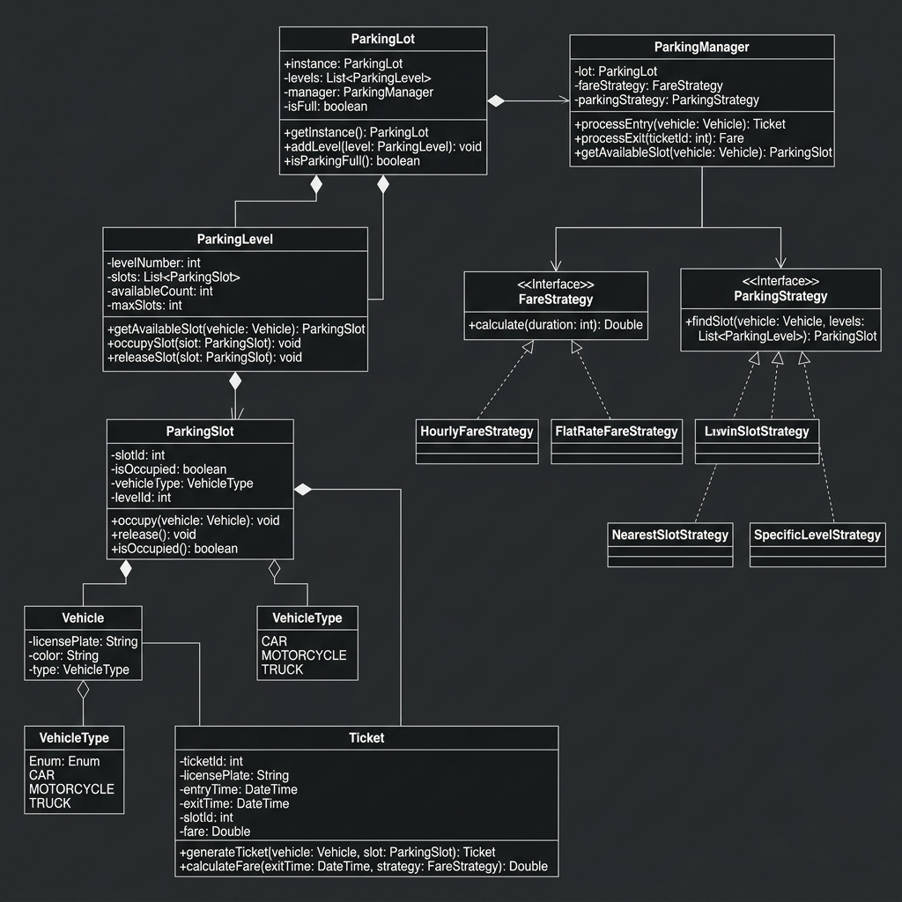

## Multilevel Parking Lot Design Problem Statement

## Design a multilevel parking lot system with the following requirements:
## Functional Requirements
-The parking lot should support three types of parking slots:
Small: for 2-wheelers
Medium: for cars
Large: for buses

-The system should maintain different hourly parking charges for each slot type.
When a vehicle enters the parking lot, the system should:
assign a parking slot,
generate a parking ticket,
and store the following information in the ticket:
vehicle details
allocated slot number
allocated slot type
entry time
-When a vehicle exits the parking lot, the system should:
calculate the parking duration using the entry and exit times,
generate the bill,
and return the total amount to be paid.
-The parking lot has multiple entry gates.
-The system should always assign the nearest available compatible slot based on the vehicle’s entry gate.
-A smaller vehicle should be allowed to park in a larger slot if needed:
a 2-wheeler can park in a small, medium, or large slot
a car can park in a medium or large slot
a bus can park only in a large slot
-Billing should be based on the allocated slot type, not the vehicle type.
For example, if a bike is parked in a medium slot, the charge should be calculated using the medium slot rate.

## APIs to be Supported
-The system should provide the following main functions:
park(vehicleDetails, entryTime, requestedSlotType, entryGateID)
Parks a vehicle and returns the generated parking ticket.
status()
-Returns the current availability of parking slots by slot type.
exit(parkingTicket, exitTime)
-Processes vehicle exit and returns the generated bill amount.

## Expected Deliverables
-The solution should include:
- Class Diagram (Included as `uml.png`)
- Code (Located in `src/main/java/org/example`)
- Explanation of the design and approach (Included below)

---

## System Design & Approach

### Architecture: Facade Pattern
The system uses the **Facade Pattern** implemented in the `ParkingLot` class. 
- **Goal**: Provide a simple, unified interface to a set of interfaces in a subsystem.
- **Benefit**: Clients (like the `Main` class) don't need to know about the internal complexities of `ParkingManager`, `FareCalculator`, or `ParkingStrategy`.

### Design Patterns Used
- Singleton Pattern: Ensures only one instance of ParkingLot exists to maintain consistent state (slots, tickets) globally.
- Strategy Pattern (Slot Assignment): Decouples the algorithm for finding an available slot (NearestSlotStrategy).
- Strategy Pattern (Billing): Decouples the billing logic (HourlyFareStrategy), enabling easy support for peak-hour or membership-based pricing in the future.

### Relationships
- **Composition**: `ParkingLot` → `ParkingManager` → `ParkingLevel` → `ParkingSlot`. Child components are strictly owned by their parents.
- **Aggregation**: `ParkingSlot` ↔ `Vehicle`. A vehicle can exist independently of the parking system.
- **Association**: `Ticket` holds references to `Vehicle` and `ParkingSlot` for tracking and billing.

### Proximity Assignment Logic
To find the **nearest available compatible slot**, the system:
1. Identifies the **level of the entry gate**.
2. Iterates all levels and calculates the distance: `abs(Level Number - Gate Level)`.
3. Checks for **size compatibility**: 2-wheelers can fit in any slot, while larger vehicles require Medium/Large slots.
4. Assigns the first available slot in the closest level.

### SOLID Principles
- **Single Responsibility (SRP)**: Each class (Manager, Strategy, Slot, Ticket) has a focused, single purpose.
- **Open/Closed (OCP)**: New assignment algorithms or fare rules can be added by implementing new strategies without modifying existing codebase.
- **Interface Segregation**: Focused interfaces for `ParkingStrategy` and `FareStrategy`.
