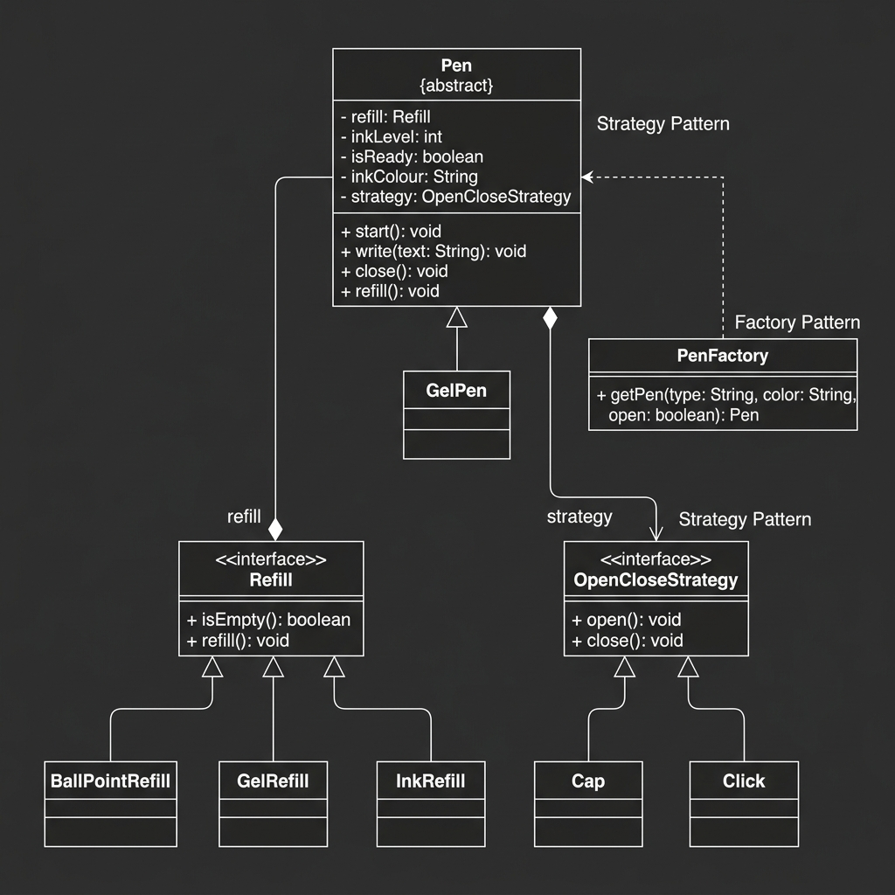

# Pen Design System

This project implements a flexible and extensible Pen design system in Java.



## Design Overview

The system is designed to handle various pen types and mechanisms while maintaining high modularity.

### Core Components

1.  **Pen (Abstract Class)**: The foundation of all pens. It orchestrates the writing process and manages internal state like ink level and ready status.
2.  **Refill (Interface)**: Encapsulates the ink storage and delivery logic.
    - `BallPointRefill`, `GelRefill`, `InkRefill`: Specific implementations for different writing styles.
3.  **OpenCloseStrategy (Interface)**: Defines how a pen is prepared for writing.
    - `Cap`: Traditional cap-based mechanism.
    - `Click`: Retractable click mechanism.
4.  **GelPen**: A concrete implementation demonstrating how to extend the base `Pen`.
5.  **PenFactory**: A specialized factory to build pens by correctly injecting the required `Refill` and `OpenCloseStrategy`.

## Design Patterns

- **Strategy Pattern**: Opening and closing logic is extracted into interchangeable strategies.
- **Factory Pattern**: Centralizes the complex pen construction logic.
- **Composition**: A `Pen` is composed of a `Refill` and a `Strategy`, rather than using deep inheritance trees.

## Getting Started

### Prerequisites
- JDK 8 or higher.

### Compilation
```bash
javac -d out src/main/java/org/example/**/*.java src/main/java/org/example/*.java
```

### Running the Demo
```bash
java -cp out org.example.Main
```