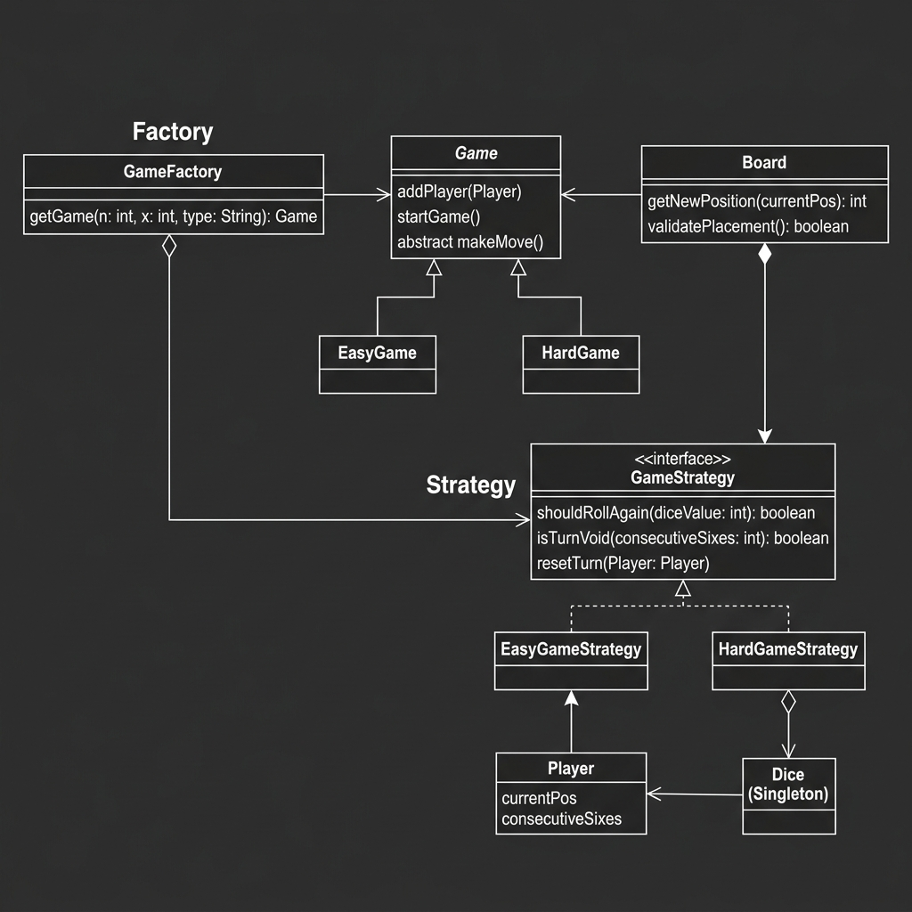

# Snake and Ladder Game

A modular and extensible Snake and Ladder game implementation in Java.



## Design Overview

The game is designed with modularity in mind, allowing for different board configurations and game rules.

### Core Components

1.  **Game**: The main controller that manages the sequence of turns, players, and the board.
2.  **Board**: Represents the play area. It maintains the positions of all snakes and ladders.
3.  **Player**: Represents a participant in the game with a current position on the board.
4.  **Snake & Ladder**: Entities that modify a player's position when encountered.
5.  **Dice**: A component to generate random moves (typically 1-6).

### Design Patterns

- **Factory Pattern**: The `GameFactory` is used to create different variations of the game (e.g., Easy vs. Hard) with specific board layouts and rules.
- **Strategy Pattern**: The `GameStrategy` interface encapsulates how snakes and ladders are placed and how the game level affects difficulty.

## Rules

- The board consists of cells numbered from 1 to N^2.
- Players start at position 0.
- On each turn, a player rolls the dice and moves forward.
- If a player lands on a Snake's head, they move down to its tail.
- If a player lands on a Ladder's base, they move up to its top.
- The first player to reach the final cell wins.
- Move is ignored if it would take the player past the final cell.

## Getting Started

### Prerequisites
- JDK 8 or higher.

### Running the Demo
```bash
# Compile
javac -d out code/*.java

# Run
java -cp out Main
```